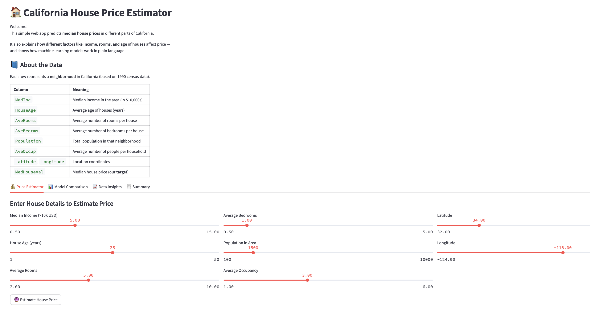
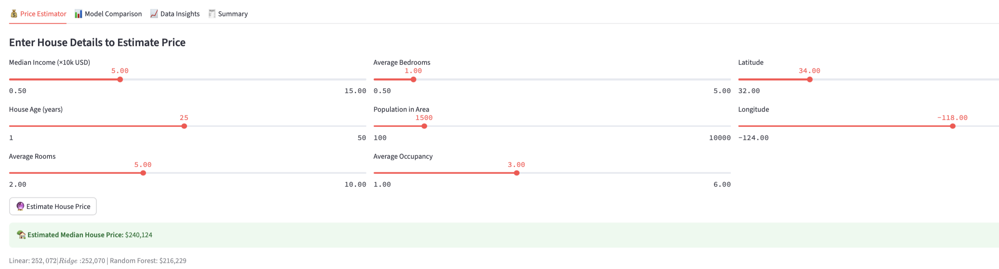
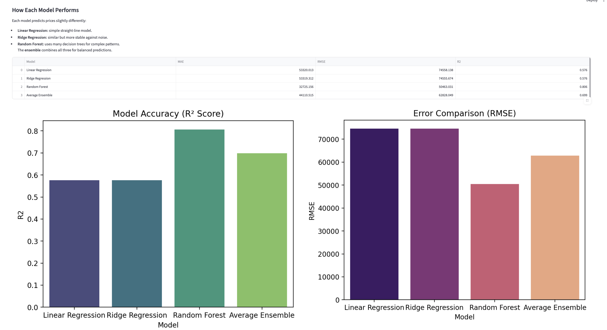
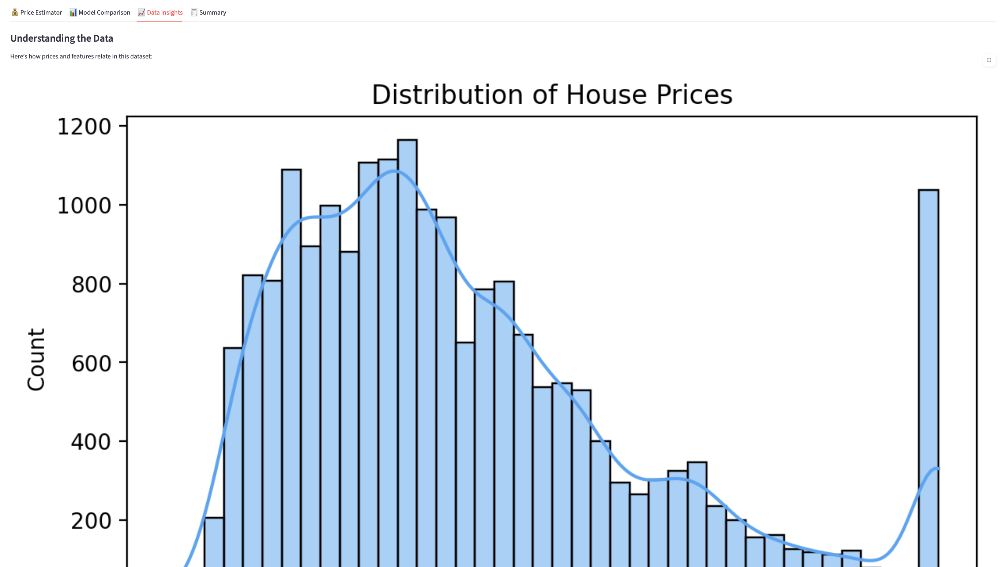
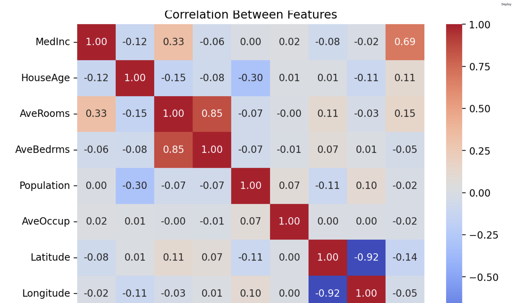
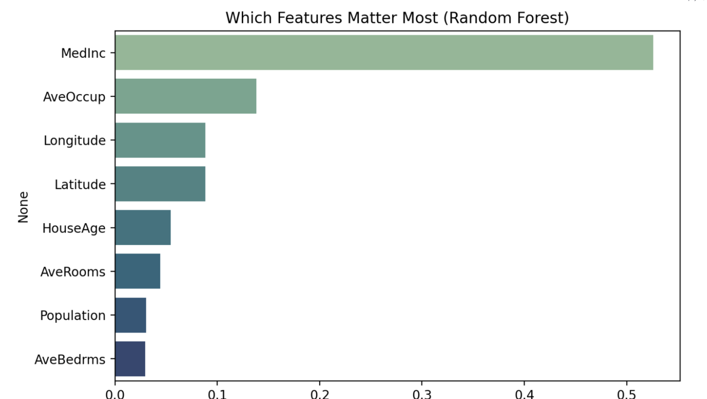
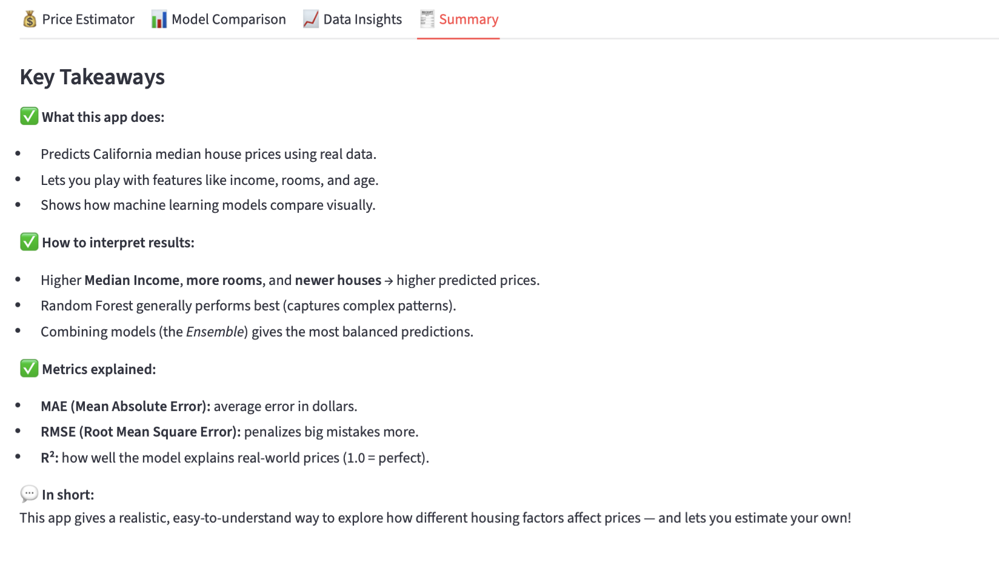

# 🏠 Interactive California House Price Estimator (Streamlit)

An **interactive machine learning web application** built using **Streamlit** that allows users to **estimate California house prices by dynamically adjusting real-world features** such as income, rooms, house age, population, and location.

Behind the scenes, the app trains and compares multiple ML models and explains their behavior in **simple, beginner-friendly language**.

---

## 🚀 Key Features

### 🎛️ Interactive Price Estimation
- Adjust house features using sliders:
  - Median income
  - House age
  - Number of rooms & bedrooms
  - Population & occupancy
  - Latitude & longitude
- Get **instant price predictions** in dollars
- View predictions from **multiple models side-by-side**

---

### 📊 Machine Learning Model Comparison
The app trains and evaluates:
- **Linear Regression** – simple baseline model
- **Ridge Regression** – regularized linear model
- **Random Forest Regressor** – non-linear ensemble model
- **Average Ensemble** – combined prediction for stability

**Evaluation Metrics Used**
- Mean Absolute Error (MAE)
- Root Mean Squared Error (RMSE)
- R² Score

Visual comparisons help users understand **which model performs best and why**.

---

### 📈 Data Insights & Feature Understanding
- House price distribution visualization
- Correlation heatmap between features
- Feature importance from Random Forest
- Plain-English explanations of how each factor influences price

This helps users **build intuition about housing economics**, not just ML metrics.

---

## 🧠 What This Project Demonstrates
- End-to-end machine learning pipeline
- Proper preprocessing using `Pipeline` and `ColumnTransformer`
- Model evaluation and ensemble techniques
- Translating ML outputs into a **user-friendly product**
- Streamlit best practices with caching and clean UI

---

## 🛠️ Tech Stack
- Python
- Streamlit
- Scikit-learn
- Pandas, NumPy
- Matplotlib, Seaborn

---

## ▶️ How to Run Locally

```bash
pip install -r requirements.txt
streamlit run app.py
```

## 📊 Dataset

Uses the California Housing Dataset from scikit-learn, based on 1990 U.S. Census data.
Target variable: Median house value (converted to USD).

## 💡 Key Takeaways

Median income is the strongest driver of house prices

Tree-based models capture complex patterns better than linear ones

Combining models (ensemble) leads to more balanced predictions

Interactive tools make ML more intuitive and accessible

## 📌 Who Is This For?

ML beginners looking to understand regression models

Product managers exploring feature impact

Anyone curious about how housing factors affect prices

## Screenshots













